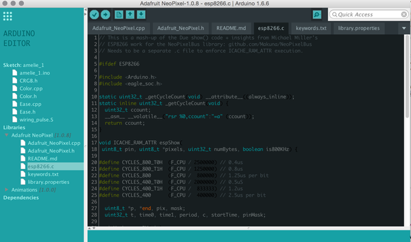
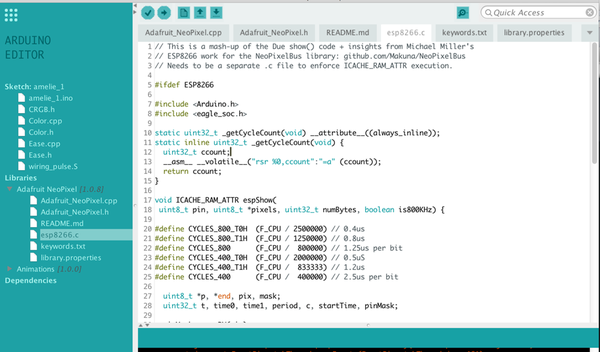

Arduino Coder
==============

I recently discovered Arduino. Working in technology, I know how difficult it is to make hard things appear simple, and I have the utmost respect for what these people have done for bringing software people like me to electronics. While the tools do a magnificent job for newcomers, I believe that an important factor in the continued growth of Arduino will be the ability of its tooling, which while remaining simple to attract new users, will have to grow alongside them as they enhance their skills.

While discovering the platform, I ran into the same inconveniences others described about the tools. Over the past couple weeks it led to a series of changes to Arduino IDE to try to add simple solutions for these pain points. Some users shared doubts in the past about technical limitations caused by the technology. I have now enough experience with the codebase to know that many low-hanging fruits exist to close the feature/ease gap that has formed with a number of alternative tools.

The code will be available, but in the meantime here is a list of the enhancements it contains: [#1](https://github.com/lmihalkovic/Arduino/issues/1)

The design is my tribute to the awesome work the [Arduino team](http://arduino.cc) as done with the upcoming [Arduino Create](https://blog.arduino.cc/2015/05/05/sneak-peak-arduino-create/). Although I am looking forward to becoming a user myself, I will always need to be able to work on projects without an Internet connection.

Arduino
========

* Arduino is an open-source physical computing platform based on a simple i/o
board and a development environment that implements the Processing/Wiring
language. Arduino can be used to develop stand-alone interactive objects or
can be connected to software on your computer (e.g. Flash, Processing, MaxMSP).
The boards can be assembled by hand or purchased preassembled; the open-source
IDE can be downloaded for free at http://www.arduino.cc/en/Main/Software

* For more information, see the website at: http://www.arduino.cc/
or the forums at: http://www.arduino.cc/forum/  
You can also follow Arduino on twitter at: https://twitter.com/arduino or
like Arduino on Facebook at: https://www.facebook.com/official.arduino

* To report a *bug* in the software or to request *a simple enhancement* go to:
http://github.com/arduino/Arduino/issues

* More complex requests and technical discussion should go on the Arduino Developers
mailing list:
https://groups.google.com/a/arduino.cc/forum/#!forum/developers

* If you're interested in modifying or extending the Arduino software, we strongly 
suggest discussing your ideas on the Developers mailing list *before* starting
to work on them. That way you can coordinate with the Arduino Team and others,
giving your work a higher chance of being integrated into the official release
https://groups.google.com/a/arduino.cc/forum/#!forum/developers

Installation
------------
Detailed instructions are in reference/Guide_Windows.html and
reference/Guide_MacOSX.html.  For Linux, see the Arduino playground:
http://www.arduino.cc/playground/Learning/Linux

Credits
--------
Arduino is an open source project, supported by many.

The Arduino team is composed of Massimo Banzi, David Cuartielles, Tom Igoe
and David A. Mellis.

Arduino uses
[GNU avr-gcc toolchain](http://gcc.gnu.org/wiki/avr-gcc),
[GCC ARM Embedded toolchain](https://launchpad.net/gcc-arm-embedded),
[avr-libc](http://www.nongnu.org/avr-libc/),
[avrdude](http://www.nongnu.org/avrdude/),
[bossac](http://www.shumatech.com/web/products/bossa),
[openOCD](http://openocd.org/)
and code from [Processing](http://www.processing.org)
and [Wiring](http://wiring.org.co).

Icon and about image designed by [ToDo](http://www.todo.to.it/)

